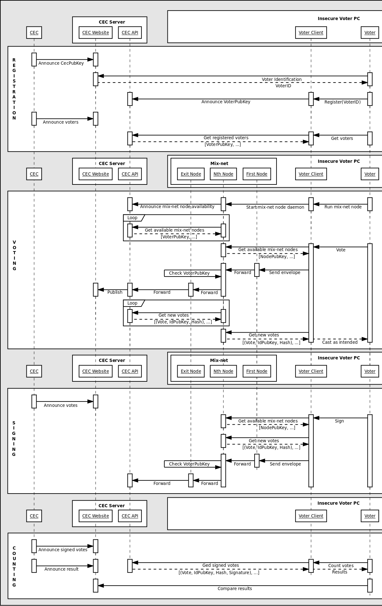

.. note::

  This project was cancelled because we found that `Helios project`_ does exactly same thing as we d and does it much better. So if you are interested in full E2E verifiable internet voting protocol see the `Helios protocol`_.
  
.. _Helios project: https://vote.heliosvoting.org/
.. _Helios protocol: http://documentation.heliosvoting.org/verification-specs/helios-v4

######################
Internet voting system
######################

This is a prototype of fully end to end verifiable internet voting system.

The protocol
============

1. Central electoral commission (CEC) announce their public key.

2. Voters identify them self using e-government gateway infrastructure and
   register their public keys generated by voting client they chose to use.

3. CEC announce data of all registered public keys together with digital
   signature of announced data file.

4. All voters download announced voters lists with information which of them
   are volunteers to form mix-net.

5. Volunteers start mix-net daemons and announce their presence to CEC.

   1) Each mix-net node ask CEC server for list of all available mix-net
      nodes and also each mix-net node update own availability status to CEC.
      This should be repeated in 10 minutes interval.

6. Each mix-net node provides API to check list of working mix-net nodes. Only
   those nodes working more than 1 hour are announced.

7. Voters send their votes using double envelope principle:

   1) Voters generate new pair of keys for vote identification and verification
      (identifier).

   2) Inner envelope contains vote value and identifier's public key.

   3) Inner envelope is encrypted with CEC's public key.

   4) Outer envelope is encrypted with public keys of randomly chosen
      mix-net nodes. Each encryption layer contains address of next node
      and envelope encrypted with public key of next node. Additionaly some
      nodes (except exit and first node) receives voters public key and
      signature of envelope.

   5) Prepared outer envelope is sent to first node, and first node will
      forward inner envelope to next node until CEC envelope will be found. If
      node receives voter's public key, it will check signature and makes sure
      that this public key exists in registered list of voters. If checks pass,
      node will random string and sends signature and his public key.

   6) All nodes checks all signatures provided by nodes who received voter's
      public key.

   7) Finally CEC will get vote value and identifier's public key.

8. Voters can send their vote many times, only last vote will be counted.

9. CEC announce votes and identifier's public keys from decrypted inner
   envelopes. Announced data are digitally signed with CEC's private key.

10. Voters receive announced voting data from a random mix-net node, find their
    identifier's public key, verifies and signs vote with identifier's private
    key. Signatures are send back to CEC, through mix-net.

11. CEC announce votes consisting of identifier's public key, vote signature
    made with identifier private key and vote value.

12. Everyone verifies signatures and counts all votes. Only signed votes are
    counted.

Additional notes
----------------

When CEC announce voters public keys, votes and signed votes, it has to be done
immediately and each received item should have hash value. This will make sure,
than order of received items was not changed. All clients can request new items
starting form given last item ID they have.

Sequence diagram
----------------

